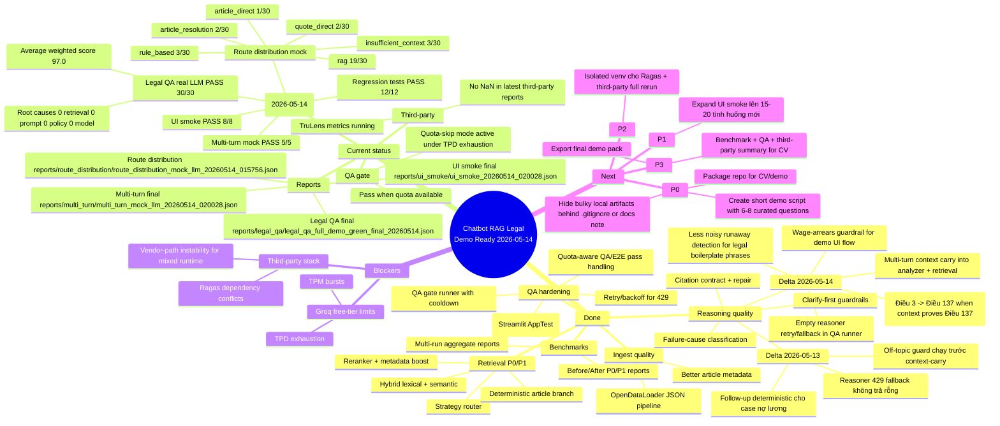

# Project Progress Mindmap

## Notes
- This map is a high-level summary for decision making.
- Source of truth remains JSON/TXT reports in `reports/`.
- Delta mới nhất được chốt theo:
  - `reports/legal_qa/legal_qa_full_demo_green_final_20260514.json`
  - `reports/ui_smoke/ui_smoke_20260514_020028.json`
  - `reports/multi_turn/multi_turn_mock_llm_20260514_020028.json`
