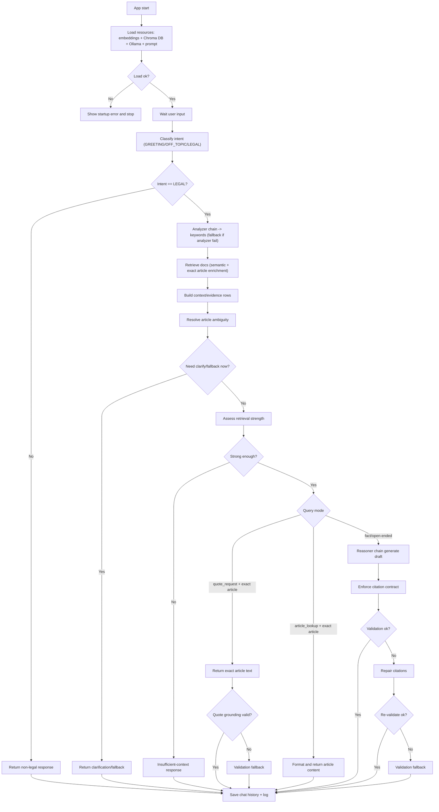

# Bot Flow Graph

```mermaid
flowchart TD
    A["App start"] --> B["Load resources: embeddings + Chroma DB + Ollama + prompt"]
    B --> C{"Load ok?"}
    C -- "No" --> C1["Show startup error and stop"]
    C -- "Yes" --> D["Wait user input"]

    D --> E["Classify intent (GREETING/OFF_TOPIC/LEGAL)"]
    E --> F{"Intent == LEGAL?"}
    F -- "No" --> F1["Return non-legal response"]
    F1 --> Z["Save chat history + log"]

    F -- "Yes" --> G["Analyzer chain -> keywords (fallback if analyzer fail)"]
    G --> H["Retrieve docs (semantic + exact article enrichment)"]
    H --> I["Build context/evidence rows"]
    I --> J["Resolve article ambiguity"]

    J --> K{"Need clarify/fallback now?"}
    K -- "Yes" --> K1["Return clarification/fallback"]
    K1 --> Z

    K -- "No" --> L["Assess retrieval strength"]
    L --> M{"Strong enough?"}
    M -- "No" --> M1["Insufficient-context response"]
    M1 --> Z

    M -- "Yes" --> N{"Query mode"}
    N -- "quote_request + exact article" --> N1["Return exact article text"]
    N1 --> N2{"Quote grounding valid?"}
    N2 -- "No" --> N3["Validation fallback"]
    N2 -- "Yes" --> Z
    N3 --> Z

    N -- "article_lookup + exact article" --> O["Format and return article content"]
    O --> Z

    N -- "fact/open-ended" --> P["Reasoner chain generate draft"]
    P --> Q["Enforce citation contract"]
    Q --> R{"Validation ok?"}
    R -- "Yes" --> Z
    R -- "No" --> S["Repair citations"]
    S --> T{"Re-validate ok?"}
    T -- "Yes" --> Z
    T -- "No" --> U["Validation fallback"]
    U --> Z
```

