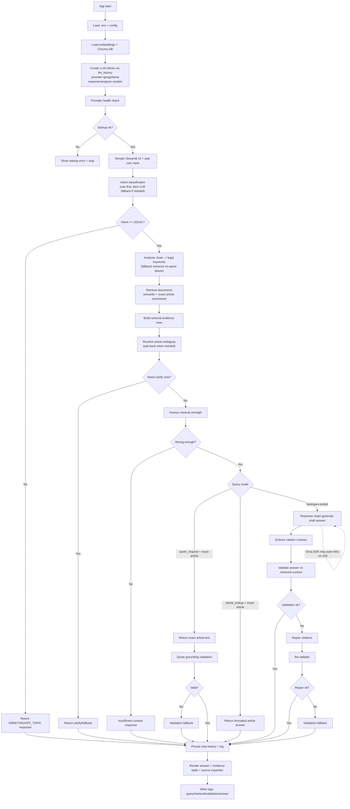

# Bot Flow Graph (Latest)

## Notes
- LLM runtime is provider-based (`groq` or `ollama`) via `src/legal_chatbot/llm_factory.py`.
- Current default setup uses Groq with:
  - reasoner: `openai/gpt-oss-20b`
  - analyzer: `openai/gpt-oss-20b`
- Retrieval/grounding policy remains the main quality gate even with stronger models.

